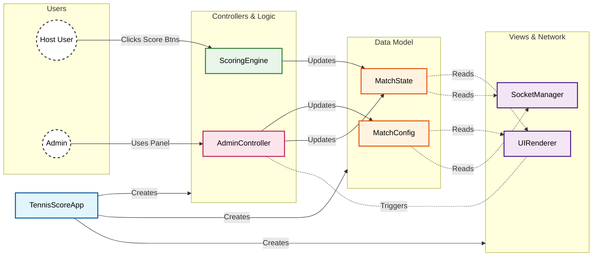

# UDP Tennis Scoreboard

A broadcast-ready tennis scoreboard application using **Node.js**, **Express**, and **Socket.io**.  
Refactored to be modular, testable, and SOLID-compliant.

## Description

This app allows you to display a real-time tennis scoreboard. One client acts as the host (controller) to update scores, while other clients (overlays, spectators) receive updates in real-time. It supports custom player names, set configuration (1, 3, or 5 sets), and full match logic including tie-breakers.

## Features

- **Real-time updates**: Instant score reflection across all connected clients.
- **Configurable**: Change player names, number of sets, and game rules.
- **Robust Logic**: Handles deuce, advantage, tie-breakers, and set transitions automatically.
- **Admin Panel**: Full control to override scores, names, or reset the match.
- **Modular Architecture**: Clean separation of concerns (Config, State, Scoring, Renderer).

## Installation

1. Clone the repository.
2. Install dependencies:
   ```bash
   npm install
   ```

## Usage

### Start the Server
```bash
npm start
```
The server will start on port `8080`.

### Host a Match
1. Open `http://localhost:8080`.
2. Click **Broadcast**.
3. Use the interface to score points for Player 1 or Player 2.
4. Use the **Configure** button to change names or correct scores.

### Spectate/Overlay
1. Open `http://localhost:8080`.
2. Click **Spectate**.
3. Enter the Match ID of the host (shown on the Host's screen).

## Testing

The project uses **Jest** for unit testing.

```bash
npm test
```

## Project Structure

- `js/app.js`: Main entry point, wires up dependencies.
- `js/config.js`: Manages game configuration.
- `js/state.js`: Manages mutable game state (points, sets).
- `js/scoring.js`: Scoring rules engine.
- `js/renderer.js`: Handles UI updates.
- `js/socket-manager.js`: WebSocket communication.
- `js/admin.js`: Admin panel logic.
- `tests/`: Unit tests for all modules.

### Architecture



## Author

themetalfleece
